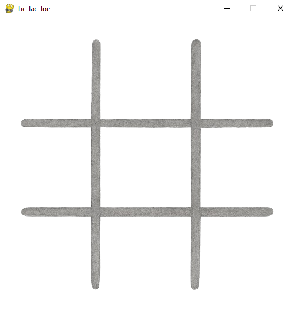
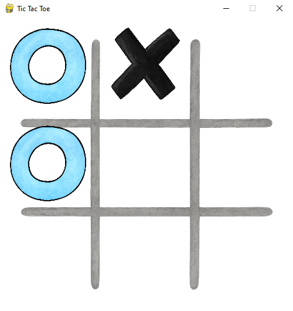
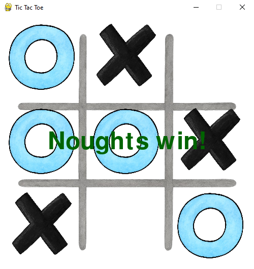

# 🎮 Tic Tac Toe (Pygame)

A simple 2-player Tic Tac Toe game built with **Pygame**.  
Players take turns placing **noughts (O)** and **crosses (X)** on a 3x3 grid until one wins or the game ends in a draw.

---

## 📷 Screenshots




---

## 📂 Project Structure
````
TicTacToe/
│── icons/
│ ├── TicTacToeG.png # Grid background image
│ ├── TicTacToeO.png # Nought (O) icon
│ └── TicTacToeX.png # Cross (X) icon
│
│── tictactoe.py # Main game script
│── README.md # Project documentation
````

---

## 🚀 How to Run

### 1️⃣ Install Python
Make sure you have **Python 3.8.0+** installed. You can check with:

````
python --version
````

While developing the game, I worked on **Python 3.13.0**

### 2️⃣ Install Dependencies
Run:

````
pip install -r requirements.txt
````

Pygame - handles the graphics and input.

Pillow - reads image sizes for scaling.

### 3️⃣ Place Game Assets
Make sure to keep the following .png files inside the icons/ folder:

- TicTacToeG.png - The game board background.

- TicTacToeO.png - Nought icon.

- TicTacToeX.png - Cross icon.

### 4️⃣ Run the Game
````
python tictactoe.py
````

---

## 🎯 How to Play

- Player 1 plays noughts

- Player 2 plays crosses

Click on an empty square to place your mark.

First player to align 3 marks in a row, column, or diagonal wins.

If all squares are filled without a winner, it’s a draw.

---

## ⚙️ Code Overview
The game follows a structured flow:

### 1️⃣ Imports & Setup
Imports pygame and PIL.Image.

Loads grid size from TicTacToeG.png.

Calculates tile width/height from grid size.

Initializes Pygame window, clock, font, and game variables.

Creates an empty 3x3 game board.

### 2️⃣ Helper Functions
- import_icon() - loads and scales assets such as grid, nought and cross icons.

- player_turn() - handles mouse clicks and updates the board.

- render_icons() - draws current board state.

- check_rows() - check_columns(), check_diagonals() - check whether winning conditions have been met.

- check_win() - combines the above to determine a winner and updates the message.

- check_draw() - detects if all cells are filled with no winner.

### 3️⃣ Main Game Loop
Iterates while running is True.


Quits if QUIT event is received.

Clears screen and draws grid.

Calls player_turn() for current player.

Draws all icons via render_icons().

Checks for win or draw.

If game is over, displays result message.

Updates display at 60 FPS.

---

#### 📜 License
This project is free to use and modify for personal or educational purposes.